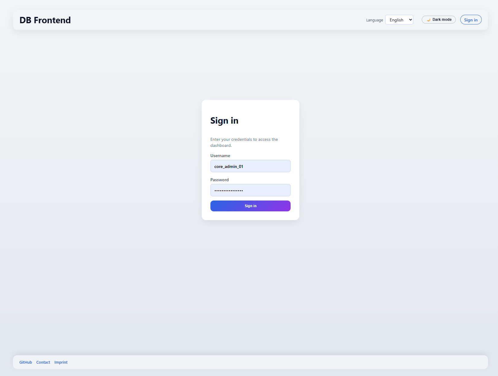
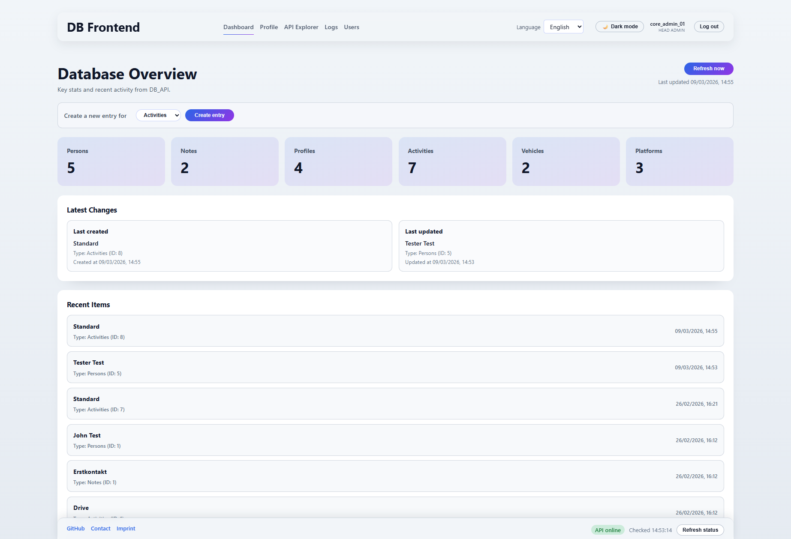
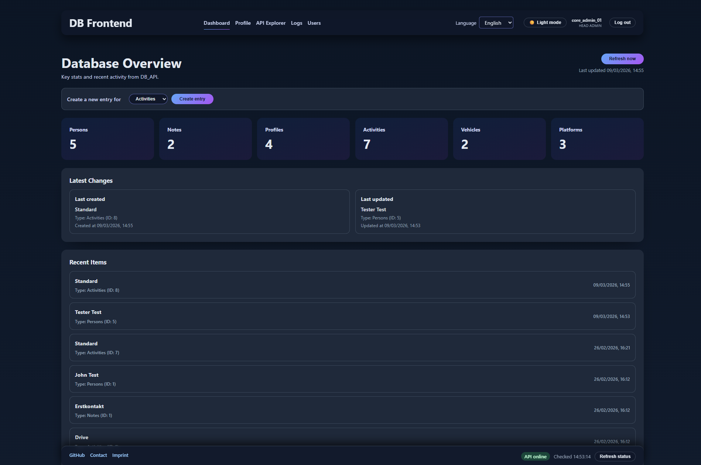
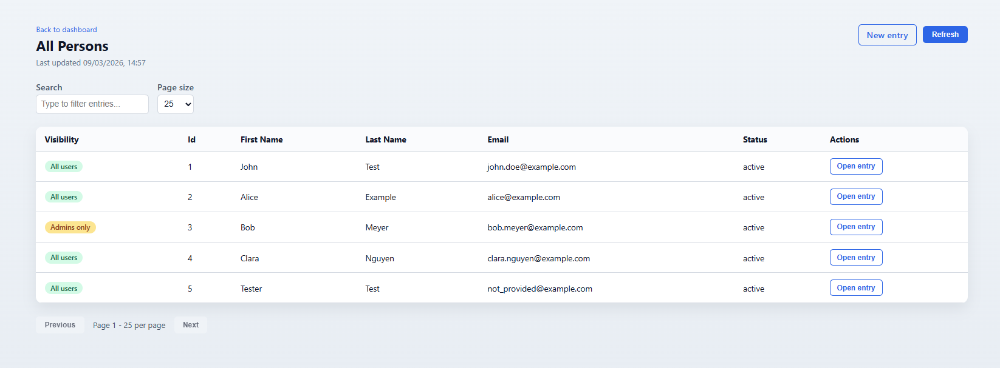
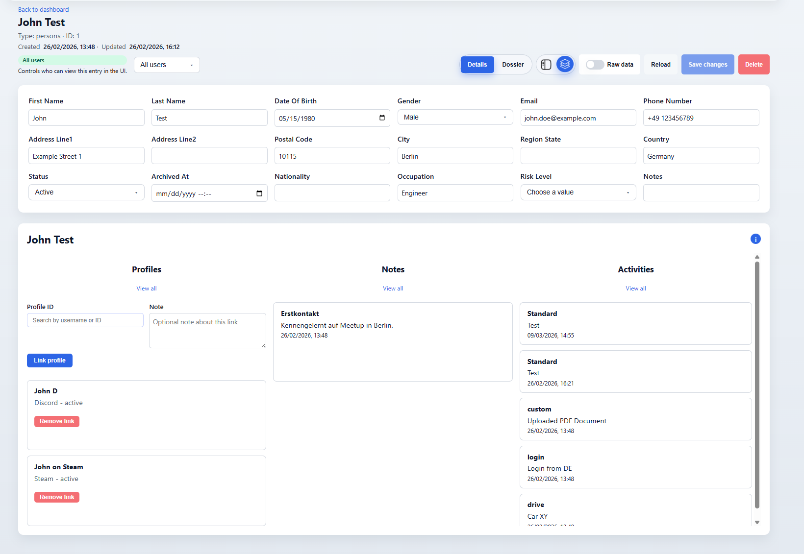
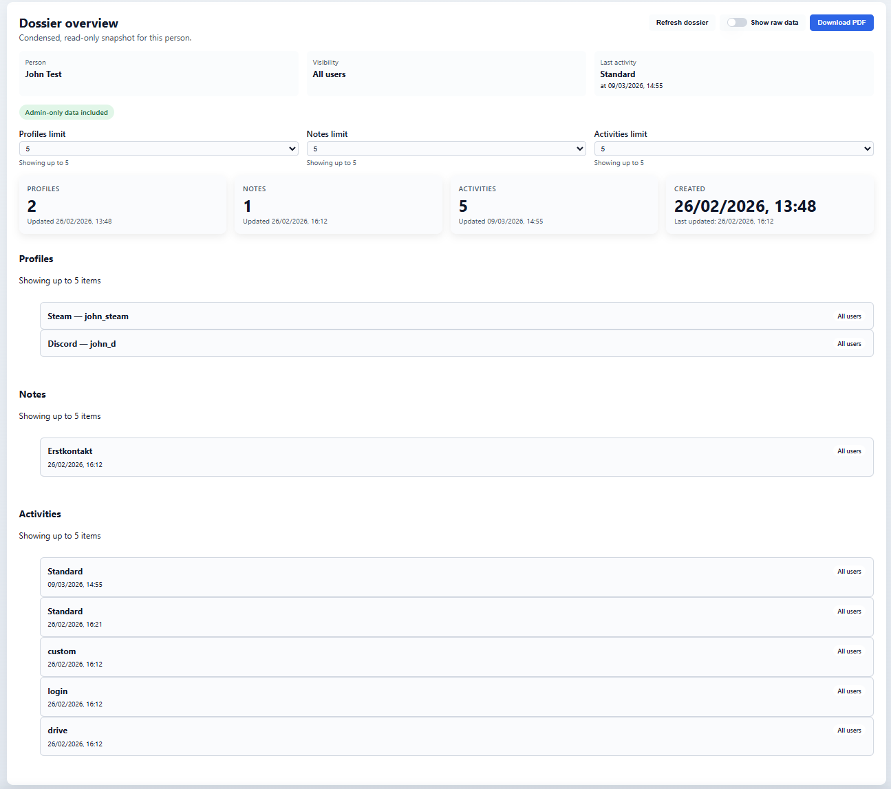
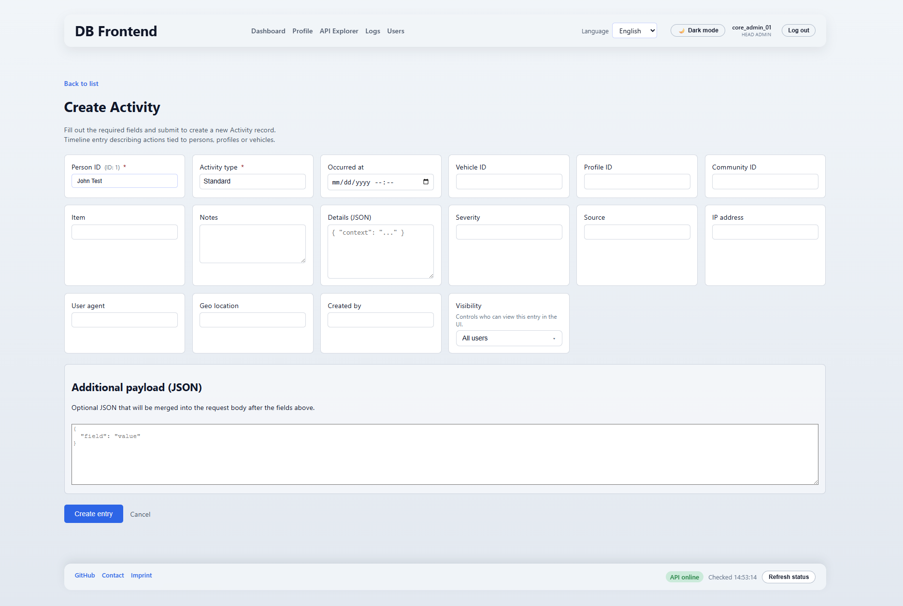
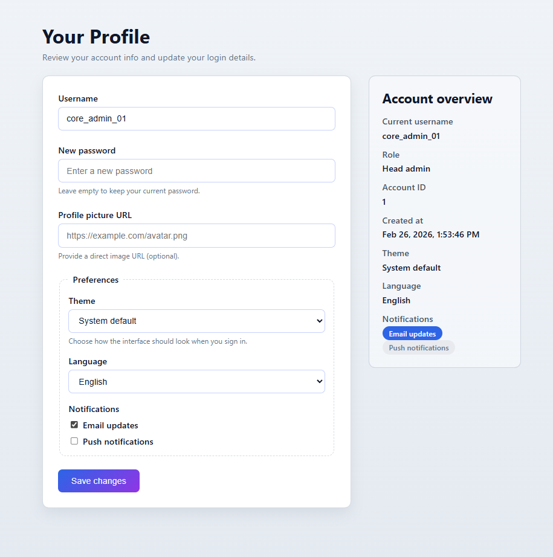
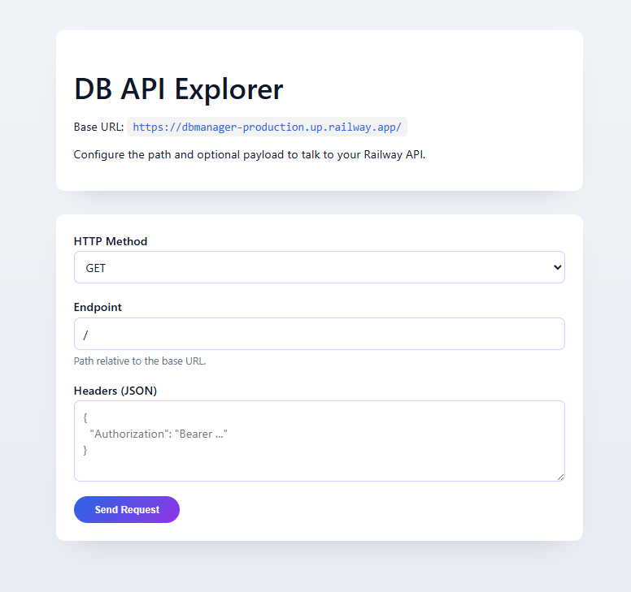
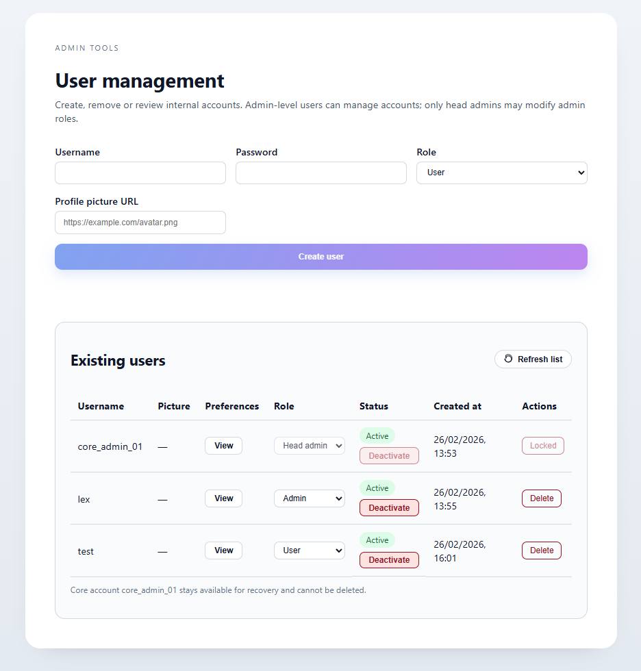

# DB Frontend

DB Frontend is an Angular web application for managing data through a REST API. The application covers the full frontend workflow: login, overview dashboard, list views, detail editing, creating new records, role-based access control, and admin features such as user management and audit logs.

## Project Overview

This project demonstrates how to build and operate a production-ready frontend:
- Clear separation of UI, business logic, and API access
- Role-based authorization model (`user`, `editor`, `admin`, `head_admin`)
- Robust API integration through centralized services
- Internationalization (German/English) and user preferences
- Deployment-ready delivery with Express + Railway

## Scope and Architecture Boundary

This repository contains the **frontend only**.
- UI, routing, forms, permissions in the client, and API integration are implemented here.
- The backend/API is a separate project and is deployed independently.
- The frontend communicates with the backend via `apiBaseUrl` from environment configuration.

Backend/API repository:
- [db_api](https://github.com/Unkn0wncod3/db_api)

## Tech Stack

- Angular 17 (Standalone Components, Reactive Forms, Signals)
- TypeScript
- `@ngx-translate/core` for i18n
- Express 5 (production hosting and SPA delivery)
- Railway for deployment

## Core Features

### Authentication and Session

- Login via `/auth/login`
- JWT is automatically attached to requests through an interceptor
- Session is stored locally and expires after 4 hours
- On `401 Unauthorized`, the user is logged out and redirected to login

### Roles and Permissions

- `user`: read-only access
- `editor`: read + create/edit
- `admin`: plus delete, API Explorer, audit logs, user management
- `head_admin`: extended administration privileges (for example top-level role assignments)

Permissions are enforced in both the UI (visible routes/actions) and API access layer.

### Dashboard

- Shows key metrics, activity information, and recent changes
- Clickable cards for fast navigation into data-type lists
- Direct links to record detail pages
- `/stats/overview` is cached with a 20-minute TTL

### List View (`/entries/:type`)

- Pagination with variable page size (`10/25/50/100`)
- Search and filtering
- Dynamic table columns based on API data
- Query parameters for stable, shareable URL state
- Special activity logic with additional person filtering

### Detail View (`/entries/:type/:id`)

- Dynamically generated form from returned fields
- Smart field types: text, number, boolean, date/datetime, JSON, select
- PATCH submits only changed fields
- Delete action with confirmation dialog
- `visibility_level` is editable for authorized roles

### Create View (`/entries/:type/new`)

- Schema-based forms per entity type
- Supported types: `persons`, `profiles`, `platforms`, `activities`, `vehicles`, `notes`
- Required field validation and special rules (for example `requireOneOf`)
- Optional raw JSON merge for flexible payload extensions

### Additional Areas

- Activities timeline with date range and person filtering
- Profile page for user data and preferences (theme, language, notifications)
- User management (create, role changes, activate/deactivate, delete)
- Audit logs with filters, timeline view, and clear-log operation
- API Explorer for manual API requests (admin)

## API and Data Behavior

- API base URL is injected via environment files
- List requests send several common parameter formats in parallel (`page`, `limit`, `pageSize`, `perPage`, `search`, `q`, `filter[...]`) for backend compatibility
- List responses are normalized robustly across payload shapes (`items`, `results`, `data`, etc.)

## Project Structure

- `db-frontend/src/app/features/` feature modules (dashboard, list, detail, create, admin, auth, profile)
- `db-frontend/src/app/core/services/` central services for API/auth/stats/user/audit
- `db-frontend/src/app/core/guards/` route protection by role
- `db-frontend/src/app/core/interceptors/` JWT + error handling
- `db-frontend/src/environments/` dev/prod configuration
- `db-frontend/server.mjs` Express server for the built application

## Screenshots

The screenshots below show a typical user flow from login to administration.

### 1. Login
Authentication view (`/login`) using a reactive form with validation and translated error handling.
On success, a JWT session is established and protected routes become accessible via route guards.


### 2. Dashboard (White Mode)
Main overview route (`/`) powered by `StatsService` with cached `/stats/overview` data (TTL-based refresh).
Cards and widgets provide fast navigation to typed entry lists and record detail routes.


### 3. Dashboard (Dark Mode)
Same dashboard module in dark theme, driven by persisted user/system theme preferences.
Demonstrates layout/theme consistency across the same routed feature component.


### 4. Entry List (Persons example)
Generic list feature (`/entries/:type`) shown for `persons`, with query-param based state (`page`, `pageSize`, `search`).
Includes server-backed pagination, search, and dynamic column derivation from API payloads.


### 5. Person Entry (Details)
Record detail route (`/entries/:type/:id`) with dynamic field-type mapping (text/number/boolean/date/json/select).
Save operation sends minimal PATCH payloads (changed fields only), with role-based edit/delete controls.


### 6. Person Dossier View
Extended person context view combining related entities and timeline-style information for cross-record analysis.
Complements the base detail form with relationship-oriented read/edit workflows.


### 7. Create Activity
Schema-driven create flow (`/entries/:type/new`) for `activities`, including required fields and rule-based validation.
Submission builds normalized payloads and sends create requests through the centralized entry service layer.


### 8. Your Profile
Account management route (`/profile`) for updating username/password/avatar and preference settings.
Preference changes (language/theme/notifications) are persisted and re-applied in the app shell.


### 9. DB API Explorer
Admin-only API test console for manual `GET/POST/PUT/PATCH/DELETE` requests against configured base URL endpoints.
Supports JSON body/header input, request execution, and direct response/error inspection for troubleshooting.


### 10. User Management
Admin user-management module for account lifecycle operations: create, role changes, activate/deactivate, delete.
Enforces role hierarchy constraints and protected-account safeguards at UI/service level.


## Requirements

- Node.js >= 20.12 (recommended >= 20.19)
- npm

## Local Setup

```bash
cd db-frontend
npm install
```

### Development

```bash
npm run dev
```

Starts the Angular dev server at `http://localhost:4200`.

### Production-like Preview

```bash
npm run preview
```

Builds the app and starts Express at `http://localhost:8080`.

## Deployment (Railway)

1. Set the production API URL in `db-frontend/src/environments/environment.ts`
2. Build command: `npm run build`
3. Start command: `npm start`
4. Allow CORS on the backend for your frontend domain

## Docker Deployment Model

Frontend and backend can run as separate Docker containers.
- `db-frontend` container: serves the built Angular app through Express
- `db-api` container: serves REST endpoints from your separate API repository
- Both services can run in the same Docker network and communicate via service name

Example setup idea:
- Frontend container is built with an environment API base URL pointing to the backend container/service (for example `http://db-api:3000`)
- Reverse proxy (optional) can expose both services under one domain

## Root Scripts

- `npm run build` builds the frontend
- `npm start` starts `server.mjs`
- `npm run dev` starts the Angular dev server
- `npm run preview` builds and runs locally in a production-like mode
